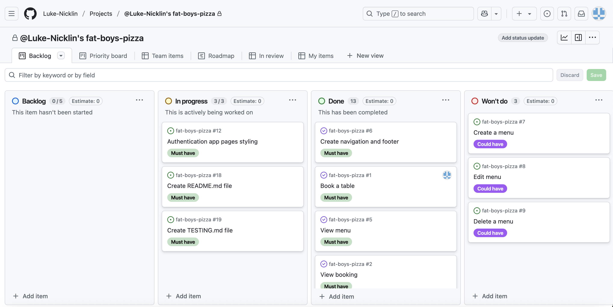
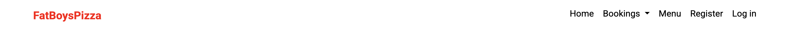
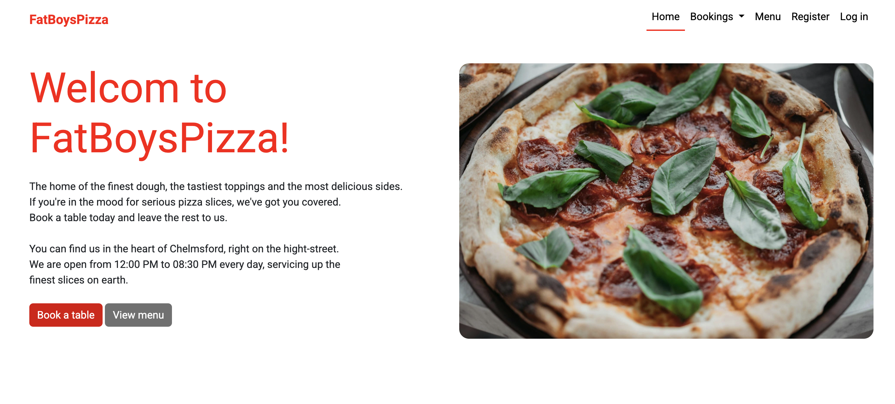
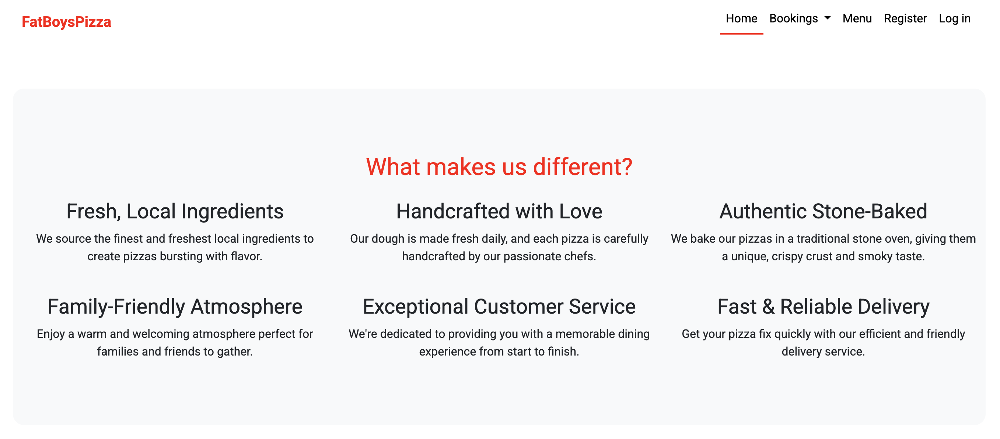
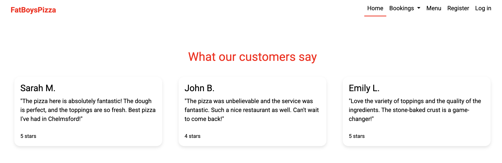
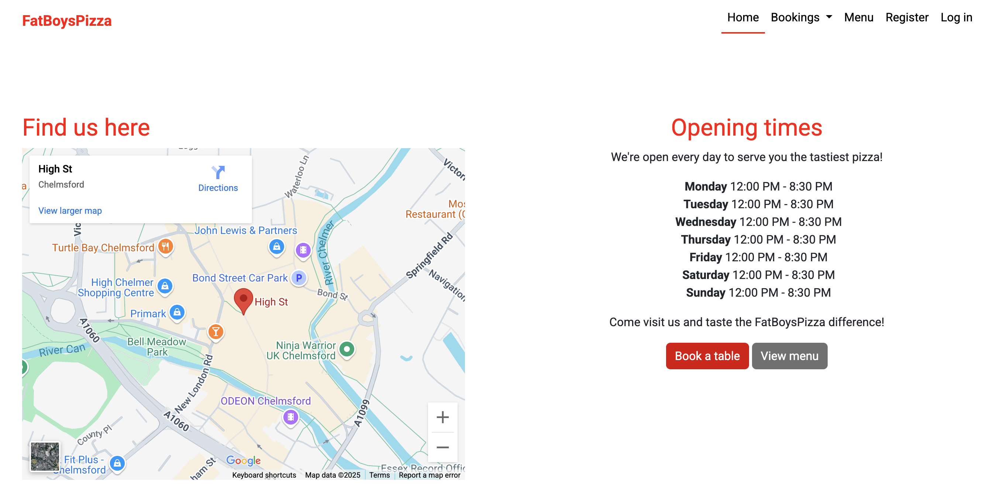

# FatBoysPizza

FatBoysPizza is a restaurant booking web app for a fictional pizza restaurant based in Chelmsford, Essex. The app allows restaurant staff and customers to easily manage restaurant bookings. The customer can register, login and create a booking for a date and time that suits them. They can then edit this booking or cancel the booking via the web app. The live link can be found here: <link>

Insert mockup when complete

## Table of contents
- [FatBoysPizza](#fatboysPizza)
    - [Table of contents](#table-of-contents)
- [Site goals](#site-goals)
- [Planning](#planning)
    - [Agile](#agile)
        - [User stories](#user-stories)
    - [Wireframes](#wireframes)
    - [Design](#design)
- [Features](#features)
    - [Features left to implement](#features-left-to-implement)
- [Database design](#database-design)
- [Security](#security)
- [Technologies](#technologies)
- [Testing](#testing)
- [Deployment](#deployment)
    - [Version control](#version-control)
    - [Heroku deployment](#heroku-deployment)
    - [Run locally](#run-locally)
    - [Fork project](#fork-project)
- [Credits](#credits)

# Site goals

The website aims to help the restaurant to take bookings online and allow staff to easily keep track of upcoming bookings and make changes to bookings when neccessary.

The website also aims to help customers to easily view the restaurant's menu and book a table online. They will also be able to edit the booking and cancel the booking via the website.

 # Planning
 ## Agile

To develop this project I used an Agile approach, dividing the work into phases and building the website iteratively to maximise efficiency. I used a kanban board with tickets containing different user stories with prioritised labels that included 'Must have', 'Should have' and 'Could have'. Each ticket defined the user story and the acceptance criteria.

## User Stories

**Base set up**

As a developer, I need to create the base.html page and structure so that other pages can reuse the layout

As a developer, I need to create the header.html and footer.html pages so that other pages can resume the layout

As a developer, I need to create folders and files for images, css and javascript

As a developer, I need to include the social links in the footer.html so it appears on every page

As a developer, I need to create the nav bar so users can easily navigate the website

**Authentication app**

As a developer, I need to set up allauth so that users can easily register and login to the website

As a developer, I need to style the allauth pages to have the same styling as the rest of the website

**Menu**

As a user, I would like to be able to view the menu, so that I can see what types of pizza are available.

**Booking**

As a user, I wan to be able to select a date, time and number of guests so that I can book a table at the restaurant.

As a user, I want to view my existing bookings, so I can keep track of my reservations.

As a user, I want to edit my booking, so that I can change the details if needed.

As a user, I want to cancel my booking, so I can let the restaurant know I no longer need the table.

**Documentation**

As a developer, I need to create a reade.md file, so that other developers can easily understand my website

As a developer, I need to create a testing.md file, so that I can show the tests I completed for the website

## Wireframes

- Home page

- Menu

- Register

- Log in

- Add booking

- Your bookings

- Edit booking

- Delete booking

- Sign out

- 403 error

- 404 error

- 500 error

# Features

**Navigation bar**

The navigation bar is visible on all pages and includes links to Home, Bookings, Menu, Register, Log in and Log out when a user is logged in. The navigation converts to a hamburger menu on smaller devices so the user can view and navigate the site on all devices.

The following nav links appear on every screen:

- Home (routes to index.html) - visible to all users
- Bookings (drop down)
    - Manage bookings (routes to manage-bookings.html) - visible to all users
    - Add booking (routes to add-booking.html) - visible to all users
- Menu (routes to menu.html) - visible to all users
- Register (routes to signup.html) - visible to logged out users
- Log in (routes to login.html) - visible to logged out users
- Log out (routes to logout.html) - visible to logged in users

**Home page**

The home page hero section incldudes a welcome headline and some introductory content that immediately informs the user what the website is for.

There are buttons to 'Book a table' and 'View menu' so the user can easily achieve what they want to achieve whilst visiting the website.

There is a 'What makes us different?' section that explains why a user should visit the restaurant. Plus, there is a 'What our customers say' section that shows some of the reviews from the restaurant's customers.

At the bottom of the home page, there is an embeded Google map so users can easily find us. And there is an opening times section so users know when we're open.

**Footer**

The footer includes links to the restaurant's social media pages so the user can easily follow us online. This includes links to LinkedIn, Instagram, X and YouTube.

