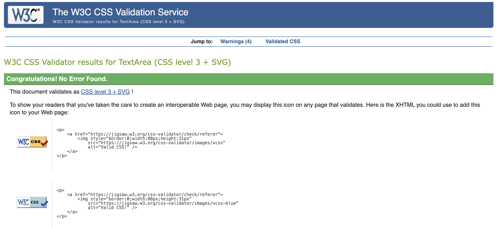

# Functional testing

**Navigation links**

All navigation links on all pages have been tested to make sure that they navigate to the correct pages.

- Home -> index.html
- Bookings drop down, Manage bookings -> manage-bookings.html
- Bookings drop downs, Add booking -> add-booking.html
- Menu -> menu.html
- Log in -> Log in all auth page
- Register -> Sign up all auth page
- Log out -> Log out all auth page

**Authentication**

Test: Make sure a user can register an account with the website

Steps:

1. Navigate to [fat-boys-pizza](https://fat-boys-pizza-70a70bee766d.herokuapp.com/) and select 'Register' in the nav bar.
2. Enter an email address, username and password
3. Click Sign up

Expected:

The account is created and the user sees a toast message that says 'Successfully signed in as (username).' The user can now make a booking and manage their bookings.

Actual:

The account was created and the site displayed a toast message that said 'Successfully signed in as (usernam).' Was then able to make a booking and manage bookings.

Test: Make sure a user can log in once registered

Steps:

1. Navigate to [fat-boys-pizza](https://fat-boys-pizza-70a70bee766d.herokuapp.com/) and select 'Log in' in the nav bar.
2. Input log in details
3. Select 'Log in'

Expected:

The user can successfully log in with their details and is redirected to the home page

Actual:

The user successfully logged in with their details and was redirected to the home page

Test: Make sure a user can log out

Steps:

1. Log in to the website
2. Select the 'Log out' nav link
3. Select 'Log out' on the 'Log out' screen

Expected:

The user logs out of the website

Actual:

The user is logged out of the website

**Booking Forms**

Test: Make sure a user can add a booking

Steps:

1. Navigate to the  - log in if prompted.
2. Enter the following booking details:
    - Name: Luke
    - Phone number: 07912345678
    - Table: Table 1 - Capacity: 6
    - Booking time: any drop down option
    - Date: any future date
    - Geusts: 4
3. Select 'Add booking'

Expected:

Form successfully submits and the user is taken to the 'Booking Confirmed' screen with the booking details

Actual:

Form successfully submitted and the user was taken to the 'Booking Confirmed' screen with the booking details

Test: Make sure a user can edit a booking

Steps:

1. Navigate to the  - log in if prompted.
2. Select 'Edit' on a booking
3. Update the booking
4. Select 'Update booking'

Expected:

Form successfully submits, the user is taken back to the manage bookings page and a toast message is shown in the top righ-hand corner informing the user that the booking has been updated.

Actual:

Form successfully submitted, the user was taken back to the manage bookings page and a toast message was shown in the top right-hand corner informing the user that the booking had been updated.

Test: Make sure a user can delete a booking

Steps:

1. Navigate to the  - log in if prompted.
2. Select 'Delete' on a booking
3. Select 'Delete' on the 'Confirm booking deletion' page

Expected:

The user is taken back to the manage bookings page, the booking has been deleted and a toast message appears in the top right-hand corner of the screen informing the user that the booking has been deleted.

Actual:

The user was taken back to the manage bookings page, the booking was deleted and a toast message appeared in the top right-hand corner of the screen informing the user that the booking had been deleted.

**Menu**

Test: The user can view the restaurant menu

Steps:

1. Navigate to the website and select the 'Menu' nav link

Expected:

The user is taken to the 'Menu' page.

Actual:

The user was taken to the 'Menu' page.

**Footer**

The social links within the footer were tested to make sure the social media pages openened in a new tab when selected.

- LinkedIn -> opens in a new tab
- Instagram -> opens in a new tab
- X -> opens in a new tab
- YouTube -> opens in a new tab

## Negative testing

Tests were carried out to ensure validation messaging would appear if a user attempts to:

1. Book a date in the past
2. Book a table with more guests than the table capacity
3. Book a table that is already booked for the same date and time
4. Edit a booking so there are more guests than the table capacity

## Unit testing

Unit tests were carried out to test functionality for the booking and menu apps. Each test resulted with an 'OK' as seen in the images below. However, a persistant '?: (account.W001) ACCOUNT_LOGIN_METHODS conflicts with ACCOUNT_SIGNUP_FIELDS' warning appeared in both tests. Despite numerous attempts at resolving the issue, I could not run the tests without seeing this warning.

# Accessibility

[Wave Accessibility](https://wave.webaim.org/) tool was used for final testing of the deployed website to check for any accessibility issues.

Testing checked to see if the following criteria were met:

- Color contrasts meet a minimum ratio as specified in [WCAG 2.2 Contrast Guidelines](https://www.w3.org/WAI/WCAG22/Understanding/contrast-minimum.html)
- Heading levels are not missed or skipped to ensure the importance of content is relayed correctly to the end user
- All content is contained within landmarks to ensure ease of use for assistive technology, allowing the user to navigate by page regions
- All non textual content had alternative text or titles so descriptions are read out to screen readers
- HTML page lang attribute has been set
- Aria properties have been implemented correctly
- WCAG 2.2 Coding best practices being followed

# Lighthouse

The lighthouse report showed good scores across all pages. However, there was a low score on the home page for Best Practices to do with the embeded Google Map. This is because Google is moving towards a new experience that allows users to choose to browse without third-party cookies. This is not something I can resolve at this moment in time.

- Home

- Add booking

- Booking confirmed

- Manage bookings

- Edit booking

- Confirm booking deletion

- Menu

- Log in

- Register

# Validator testing

- HTML

    - No errors were returned when passing the home page through the official W3C validator

    - No errors were returned when passing the register page through the official W3C validator

    - No errors were returned when passing the log in page through the official W3C validator

    - No errors were returned when passing the manage bookigns page through the official W3C validator

    - No errors were returned when passing the add booking page through the official W3C validator

    - No errors were returned when passing the booking confirmed page through the official W3C validator

    - No errors were returned when passing the edit booking page through the official W3C validator

    - No errors were returned when passing the confirm booking deletion page through the official W3C validator

    - No errors were returned when passing the menu page through the official W3C validator

    - No errors were returned when passing the log out page through the official W3C validator

- CSS

    - No errors were returned when passing the bass.css file through the official W3C Validator

    - No errors were returned when passing the menu.css file through the official W3C Validator

    - No errors were returned when passing the booking.css file through the official W3C Validator

# Responsiveness

# Bugs
